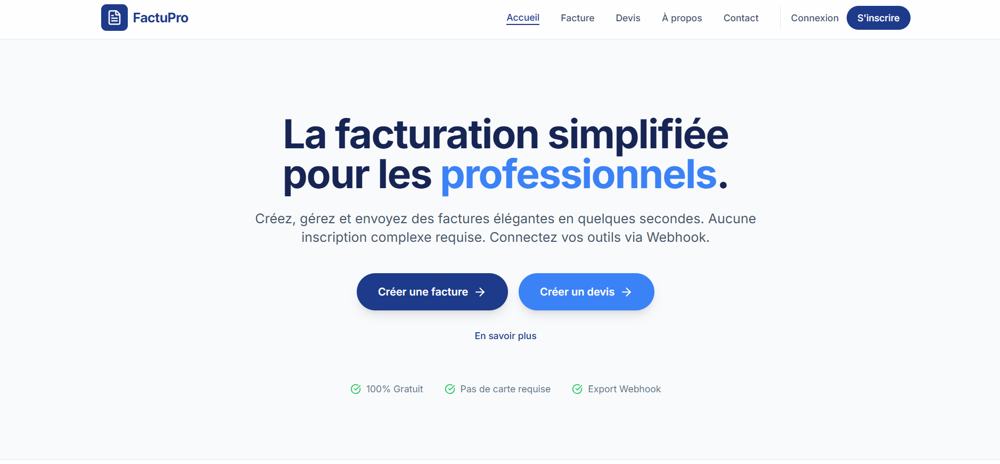

# Factumation

**La facturation simplifiee pour les professionnels.**

Factumation est une application web moderne de creation de factures et devis, concue pour les freelances et PME. Elle permet de generer des documents professionnels en PDF et de les envoyer automatiquement par email.



## Fonctionnalites

- **Creation de factures** : Interface intuitive pour creer des factures professionnelles
- **Creation de devis** : Generation de devis avec date de validite
- **Generation PDF** : Export instantane en PDF via impression navigateur
- **Envoi automatique par email** : Integration Brevo (ex-Sendinblue) via Edge Function securisee
- **Multi-devises** : Support EUR, USD, GBP, CAD, CHF, MGA
- **Methodes de paiement** : Virement, CB, Cheque, PayPal, Especes, Mobile Money
- **Gestion multi-societes** : Plusieurs entreprises par compte utilisateur
- **Regions fiscales** : Support Europe (SIRET, TVA) et Madagascar (NIF, STAT)
- **Carnet de clients** : Gestion des clients avec informations fiscales
- **Historique** : Suivi des factures et devis avec statuts
- **Authentification** : Email/mot de passe et Google OAuth via Supabase
- **Formulaire de contact** : Envoi des demandes via webhook

## Stack Technologique

| Technologie | Utilisation |
|-------------|-------------|
| **React 19** | Framework frontend |
| **TypeScript** | Typage statique strict |
| **Vite** | Build tool et dev server |
| **Tailwind CSS** | Styling |
| **React Router** | Navigation SPA |
| **Supabase** | Backend (Auth, Database, Edge Functions) |
| **PostgreSQL** | Base de donnees avec RLS |
| **Brevo** | Service d'envoi d'emails |
| **html2pdf.js** | Generation PDF cote client |
| **Lucide React** | Icones |

## Architecture du Projet

```
Factupro/
├── index.html              # Point d'entree HTML
├── index.tsx               # Point d'entree React
├── App.tsx                 # Composant principal avec routing
├── types.ts                # Definitions TypeScript (interfaces)
├── constants.ts            # Configuration (devises, regions fiscales, etc.)
├── vite.config.ts          # Configuration Vite
│
├── components/             # Composants React
│   ├── Navbar.tsx          # Barre de navigation
│   ├── Hero.tsx            # Page d'accueil
│   ├── InvoiceForm.tsx     # Formulaire de creation de facture
│   ├── QuoteForm.tsx       # Formulaire de creation de devis
│   ├── Settings.tsx        # Parametres utilisateur et societes
│   ├── Dashboard.tsx       # Tableau de bord (historique)
│   ├── CompanySelector.tsx # Selecteur de societe
│   ├── ClientSelector.tsx  # Selecteur/createur de client
│   ├── AuthModal.tsx       # Modal d'authentification
│   ├── About.tsx           # Page A propos
│   ├── Contact.tsx         # Page et formulaire de contact
│   └── Footer.tsx          # Pied de page
│
├── contexts/               # Contextes React
│   └── AuthContext.tsx     # Gestion de l'authentification
│
├── services/               # Services API
│   ├── emailService.ts     # Envoi d'emails via Edge Function
│   ├── historyService.ts   # CRUD factures/devis
│   ├── clientService.ts    # CRUD clients
│   ├── companyService.ts   # CRUD societes
│   └── preferencesService.ts # Preferences utilisateur
│
├── utils/                  # Utilitaires
│   └── validation.ts       # Validation des entrees
│
├── lib/                    # Configuration
│   ├── supabase.ts         # Client Supabase
│   └── database.types.ts   # Types generes de la BDD
│
└── supabase/               # Configuration Supabase
    ├── schema.sql          # Schema de base de donnees
    └── migrations/         # Migrations SQL
```

## Installation

```bash
# Cloner le repo
git clone https://github.com/mandaniainarandriambinintsoa/Factupro.git
cd Factupro

# Installer les dependances
npm install

# Configurer les variables d'environnement
cp .env.example .env
# Editer .env avec vos credentials Supabase

# Lancer en developpement
npm run dev

# Build pour production
npm run build
```

## Configuration

### Variables d'environnement (.env)

```env
VITE_SUPABASE_URL=https://your-project-id.supabase.co
VITE_SUPABASE_ANON_KEY=your-supabase-anon-key
```

### Configuration de l'envoi d'emails (Brevo)

La cle API Brevo est stockee de maniere securisee dans les secrets Supabase :

```bash
# Via Supabase CLI
supabase secrets set BREVO_API_KEY=votre-cle-api-brevo
```

Ou via le Dashboard Supabase : **Project Settings** > **Edge Functions** > **Secrets**

---

## Revue de Code et Securite

### Audit de Securite (Janvier 2026)

Une revue de code complete a ete effectuee pour identifier et corriger les vulnerabilites de securite et les problemes de performance.

#### Corrections de Securite

| Probleme | Gravite | Solution |
|----------|---------|----------|
| **Cle API exposee** | CRITIQUE | Migration vers Edge Function Supabase - la cle Brevo est maintenant stockee cote serveur |
| **Risque XSS** | HAUTE | Ajout de l'echappement HTML dans les templates email (`escapeHtml()`) |
| **Validation manquante** | MOYENNE | Creation de `utils/validation.ts` avec validation pour emails, telephones, SIRET, NIF, IBAN, etc. |
| **Types non stricts** | BASSE | Remplacement des types `any` par des types generes de la base de donnees |

#### Optimisations de Performance

| Probleme | Impact | Solution |
|----------|--------|----------|
| **Politiques RLS non optimisees** | 20 politiques re-evaluaient `auth.uid()` pour chaque ligne | Migration appliquee : `auth.uid()` remplace par `(select auth.uid())` |

#### Optimisation du Bundle (Janvier 2026)

Le bundle de production a ete optimise pour reduire le temps de chargement initial :

| Metrique | Avant | Apres | Gain |
|----------|-------|-------|------|
| **Bundle initial** | 1,557 KB | 202 KB | **-87%** |
| **Gzip initial** | 436 KB | 63 KB | **-85%** |

**Techniques appliquees :**

1. **Code splitting avec React.lazy()** - Les pages sont chargees a la demande
2. **Manual chunks (Vite/Rollup)** - Separation des vendors (react, supabase, icons, pdf)
3. **Import dynamique de html2pdf.js** - Charge uniquement lors de l'export PDF

**Chunks generes :**

| Chunk | Taille | Chargement |
|-------|--------|------------|
| `index.js` | 202 KB | Initial |
| `vendor-supabase` | 172 KB | Initial |
| `vendor-react` | 48 KB | Initial |
| `vendor-icons` | 18 KB | Initial |
| `vendor-pdf` | 984 KB | A la demande (export PDF) |
| Pages (Hero, Dashboard, etc.) | 2-28 KB | Lazy load |

#### Edge Function Securisee

L'envoi d'emails passe maintenant par une Edge Function Supabase qui :
- Stocke la cle API Brevo cote serveur (non exposee au client)
- Valide les donnees d'entree (emails, format des donnees)
- Echappe les donnees HTML pour prevenir les attaques XSS
- Requiert une authentification JWT valide

```
Endpoint: /functions/v1/send-email
Methode: POST
Auth: Bearer token (JWT Supabase)
```

### Validation des Donnees

Le module `utils/validation.ts` fournit des fonctions de validation pour :

| Fonction | Description |
|----------|-------------|
| `validateEmail()` | Validation format email |
| `validatePhone()` | Validation numero de telephone |
| `validateSiret()` | Validation SIRET (14 chiffres + algorithme Luhn) |
| `validateVatNumber()` | Validation N° TVA intracommunautaire |
| `validateNif()` | Validation NIF (Madagascar) |
| `validateStat()` | Validation STAT (Madagascar) |
| `validateIban()` | Validation IBAN |
| `validateBic()` | Validation BIC/SWIFT |
| `validateLineItems()` | Validation des lignes de facture |

### Row Level Security (RLS)

Toutes les tables utilisent des politiques RLS optimisees :

```sql
-- Exemple de politique optimisee
CREATE POLICY "Users can view their own invoices" ON invoices
  FOR SELECT USING ((select auth.uid()) = user_id);
```

Tables protegees : `invoices`, `quotes`, `clients`, `companies`, `user_preferences`

### Recommandations de Configuration

#### Activer la protection contre les mots de passe compromis

1. Dashboard Supabase > **Authentication** > **Settings** > **Security**
2. Activer **"Leaked password protection"**

Cette fonctionnalite verifie les mots de passe contre la base HaveIBeenPwned.

---

## Base de Donnees

### Schema

```sql
-- Tables principales
invoices        -- Factures
quotes          -- Devis
clients         -- Carnet de clients
companies       -- Societes de l'utilisateur
user_preferences -- Preferences utilisateur
```

### Migrations

Les migrations sont gerees via Supabase :

| Migration | Description |
|-----------|-------------|
| `create_invoices_table` | Table des factures avec RLS |
| `create_quotes_table` | Table des devis avec RLS |
| `create_clients_table` | Table des clients avec RLS |
| `create_user_preferences_table` | Preferences utilisateur |
| `fix_function_search_path` | Correction securite fonctions |
| `create_companies_table` | Gestion multi-societes |
| `add_fiscal_info_column` | Colonne info fiscale |
| `add_fiscal_fields_to_companies_and_clients` | Champs fiscaux (NIF, STAT, SIRET, TVA) |
| `optimize_rls_policies` | Optimisation RLS avec `(select auth.uid())` |

---

## Scripts Disponibles

| Script | Description |
|--------|-------------|
| `npm run dev` | Lance le serveur de developpement |
| `npm run build` | Build pour la production |
| `npm run preview` | Previsualise le build de production |

## Auteur

**Mandaniaina Randriambinintsoa**
- Email : mandaniaina.randriambinitsoa@gmail.com
- Localisation : Tananarive, Madagascar

## Developpement

Ce projet a ete initie avec **Google AI Studio** (Gemini) et est maintenu avec **Claude Code** (Anthropic).

## Licence

Ce projet est sous licence MIT.
